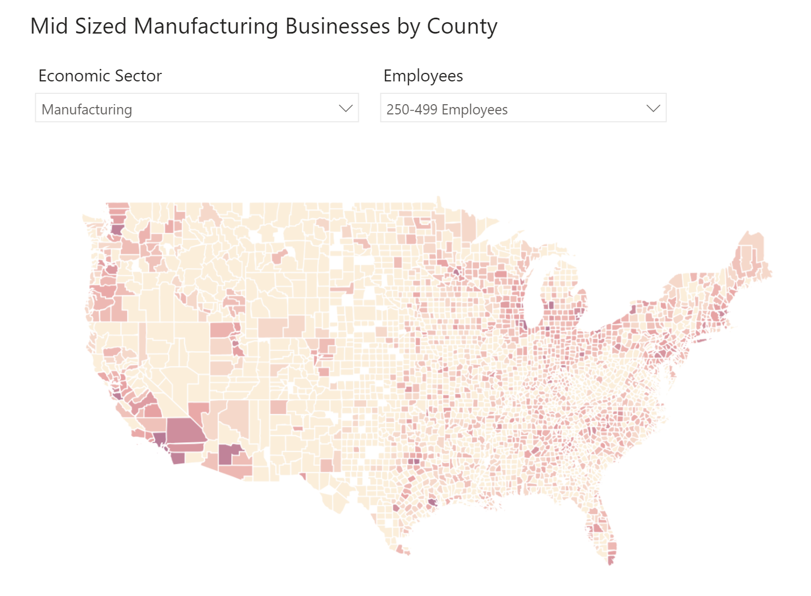

# Census Data Warehouse

The Census Data Warehouse is a personal project of mine to store free public data from the US census in a data warehouse for analytics projects.

_Mid sized manufacturing businesses by county - built using data from Census Data Warehouse and Power BI_

## Data Sources

Most of the data is collected from the following locations:

+ [US Census API](https://www.census.gov/developers/)
+ [County Business Patterns API](https://www.census.gov/data/developers/data-sets/cbp-nonemp-zbp/cbp-api.html)

## Data Warehouse Schema

_Updated as of __11/08/2019___

## Database Technology

The Data Warehouse is hosted on a personal AWS RDS instance.

## Data Loading Methodology

Data is loaded using various Python scripts, all of which can be found in the [Python](./python/) folder.

SQL Scripts for table and view creations can be found in the [SQL](./SQL/) folder.

## Contact

For more information, please contact [Jarred Glaser](mailto:jarred.glaser@gmail.com)

## License

The resources used for this project are open source under the MIT License.
